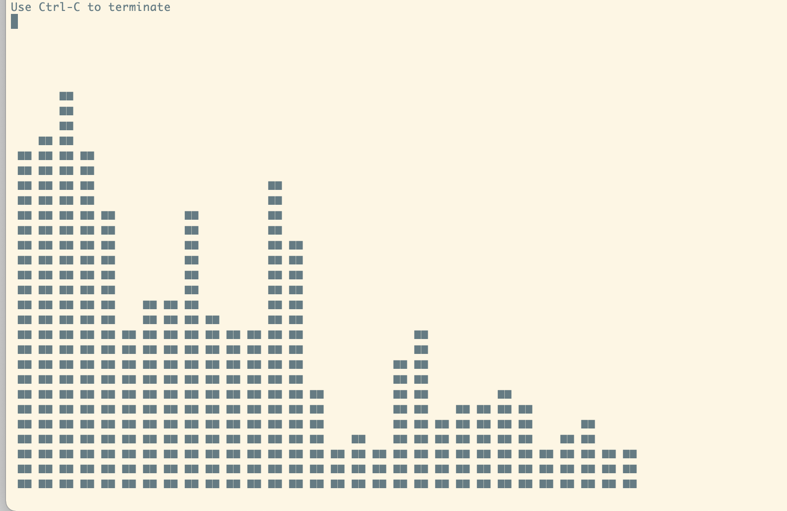

# audio_fft

## 機能

PCへの音声入力のオーディオスペクトラム（周波数特性のグラフ）を、リアルタイムでターミナル上に表示します。



## 必要なもの

- python3

ライブラリ

- pyaudio
- numpy

## 使い方

ターミナルのウィンドウが小さ過ぎるとうまく表示されないため、その場合はウィンドウを拡大して調整してください。

:warning: `print()`関数の`end=`引数を使用しているためpython2系では正しく動作しません。

```bash
python3 main.py
```